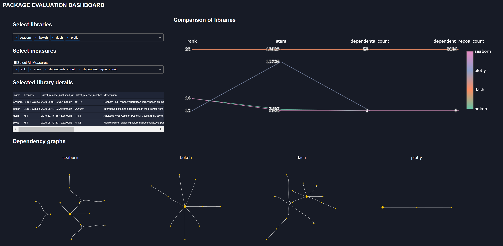

# package-eval

## About this app

This app creates a dashboard to compare open source packages over various metrics.

Data is supplied by libraries.io.

A live demo is available at [http://package-eval.herokuapp.com/](http://package-eval.herokuapp.com/)

## How to run this app locally

To run this app locally, clone this repository and open this app folder in your terminal/Command Prompt. We suggest you to create a virtual environment for installation of required packages for this app.

Get an API key from [https://libraries.io/account](https://libraries.io/account) and place the key at the root of the folder with filename api.txt. 

```
cd packge-eval
pip3 install -U pip virtualenv
py -3 -m venv venv
```
In Unix System:
```
source venv/bin/activate

```

In Windows: 

```
venv\Scripts\activate
```

Install all required packages by running:
```
pip install -r requirements.txt
```

Run this app locally by:
```
python app.py
```

## How to use this app

Select libraries and measures to compare libraries.

## Screenshot



## Resources
* [Dash](https://dash.plot.ly/)
